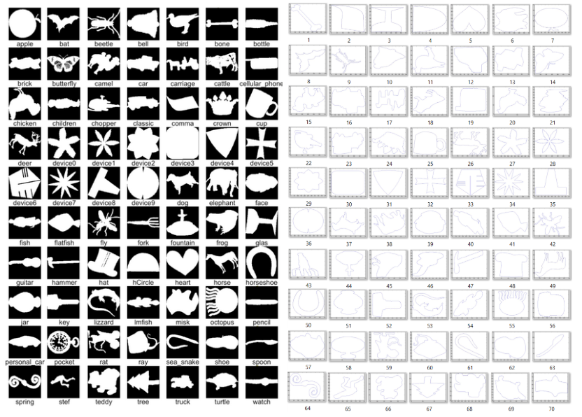
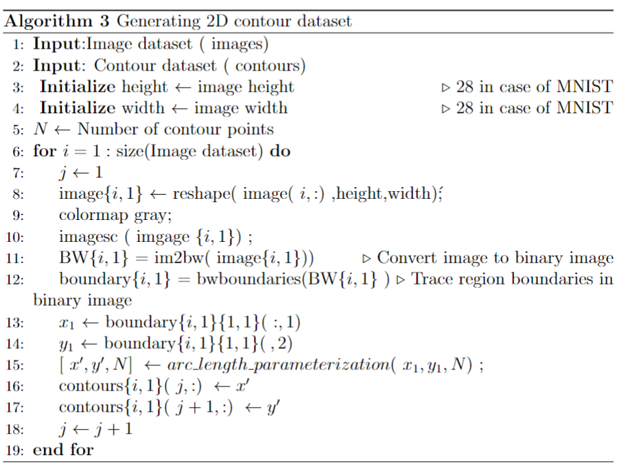
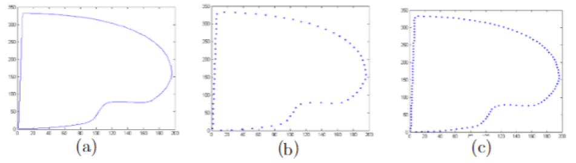
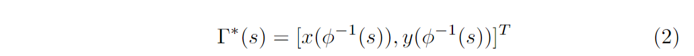
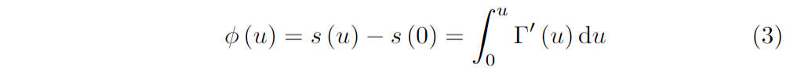

# 2D-contours dataset

In this repository, we publish our 2D, closed and planar contour datasets used to train and test the Deep learning model presented in our paper entitled
"DeepGCSS: a robust and explainable contour classifier providing Generalized Curvature Scale Space features".

For our tests, we use MPEG-7 and MNIST digits datasets. For both datasets, we proceed an arc-length re-parametrization of the 2D contours. 
A brief description of the datasets and their preprocessing is available in details in this repository. 

### MPEG-7 contours dataset:
We extract contours from the MPEG-7 database which consists of 70 types of objects each having 20 different shapes, for a total of 1400 shapes. The database is challenging due to the presence of examples that are visually dissimilar from other members of their class and examples that are highly similar to members of other classes.

Figure 1: Dataset: On the left MPEG-7 image dataset; On the right MPEG7
contour datase

### MNIST 2D contours dataset: 
The MNIST database of handwritten digits (available in the following link: http://yann.lecun.com/exdb/mnist/) is a subset of a larger set available from MNIST. It contains 70000 images. We present in the sequel our proposed algorithm where we call the $bw_boundaries$ function implemented in Matlab in order to extract external contours from this image dataset.
We divide the obtained set into 60000 contours for training and 10000 contours for validation.

Figure 2: MNIST Dataset: On the top some samples from the MNIST image
dataset; On the bottom corresponding MNIST contour dataset

Both 2-D contours extracted from MNIST digits dataset and MPEG-7 are reparametrized using the arc length parametrization. 
An illustration of this parametrization is given by the following image where (a) presents the extracted contour from a shape that belongs to MPEG-7 dataset.
Then B and C show the corresponding ontour arc-length reparameterization with respectively 70 points and 120 points

In this work, we assume that the boundary coordinates of the 2D shape is a
closed contour. Let Γ be a curve and its parameterization Γ(u) is a function
of a parametric variable u defined as:                  
             

Since the parameterization of the curve is not unique, contour coordinates
are expressed in terms of arc-length parametrization as follows:

Where φ−1(s) represents the inverse of the arc length function defined as: 

All inputs are preprocessed in this way to ensure the uniqueness of the speed we go over the curve and to get rid of the starting point problem.

